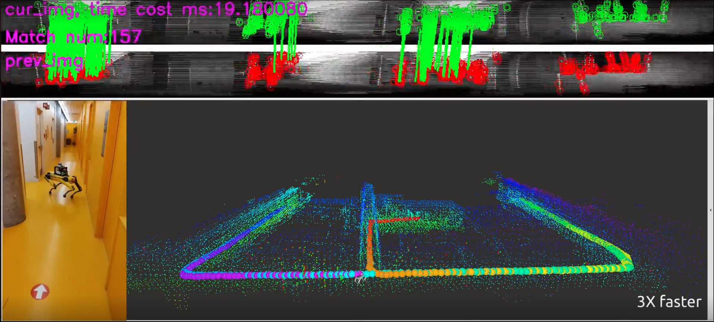

# Real-Time Simultaneous Localization and Mapping with LiDAR Intensity

The utilization of LiDAR's intensity image for scan matching addresses the issue of degeneracy.

[](https://youtu.be/B_JX0q5Cdeg)


## Paper
Thank you for citing our [paper](https://arxiv.org/abs/2301.09257) if you use any of this code or datasets.
```
@article{du2023real,
  title={Real-Time Simultaneous Localization and Mapping with LiDAR intensity},
  author={Du, Wenqiang and Beltrame, Giovanni},
  journal={International Conference on Robotics and Automation (ICRA)},
  year={2023}
}
```
## Authors

- [@Wenqiang Du](http://wenqiangdu.me/)
    - [@Linkedin](https://www.linkedin.com/in/wenqiangdu/)
    - [@Github](https://github.com/SnowCarter)
- [@Giovanni Beltrame](https://mistlab.ca/people/beltrame/)
    - [@Linkedin](https://www.linkedin.com/in/gbeltrame/)


## Installation
### Dependency

* [ROS noetic](http://wiki.ros.org/noetic/Installation/Ubuntu)
* [ceres-solver](https://github.com/ceres-solver/ceres-solver)
    ```bash
    $ mkdir ~/dependencies_ws
    $ cd ~/dependencies_ws/ 
    $ wget -O ~/dependencies_ws/ceres.zip https://github.com/ceres-solver/ceres-solver/archive/1.14.0.zip 
    $ apt-get install -y cmake libgoogle-glog-dev libgflags-dev libatlas-base-dev libeigen3-dev unzip libsuitesparse-dev 
    $ cd ~/dependencies_ws/ && unzip ceres.zip -d ~/dependencies_ws/ 
    $ cd /dependencies_ws/ceres-solver-1.14.0 
    $ mkdir ceres-bin && cd ceres-bin 
    $ cmake ..    
    $ sudo make install -j4
    ```
* [GTSAM](https://github.com/borglab/gtsam)
    ```
    $ cd ~/dependencies_ws/
    $ wget -O gtsam.zip https://github.com/borglab/gtsam/archive/4.1.0.zip
    $ unzip gtsam.zip -d ~/dependencies_ws/
    $ cd ~/dependencies_ws/gtsam-4.1.0
    $ mkdir build && cd build
    $ cmake -DGTSAM_BUILD_WITH_MARCH_NATIVE=OFF ..
    $ sudo make install -j4
    ```
* [DBOW3](https://github.com/rmsalinas/DBow3)
    ```
    $ cd ~/dependencies_ws/
    $ git clone https://github.com/rmsalinas/DBow3.git
    $ cd DBow3/ && mkdir build && cd build
    $ cmake ..
    $ make 
    $ sudo make install
    ```
### Compile and Launch
- Create workspace
    ```
    mkidr -p ~/catkin_ws/src
    ```

- Clone the project

    ```bash
    cd ~/catkin_ws/src/
    git clone https://github.com/SnowCarter/Intensity_based_LiDAR_SLAM.git
    ```

- Go to the project workspace directory

    ```bash
    cd ../
    ```

- Compile
    ```bash
    source /opt/ros/noetic/setup.bash
    catkin_make
    ```

- Launch

    ```bash
    source devel/setup.bash 
    roslaunch intensity_feature_tracker spot.launch rviz:=1
    ```
- Play bag file
    ```
    rosbag play xxx.bag --clock
    ```

## [Docker](https://www.docker.com/) support
#### Building
- Create workspace

    ```
    mkidr -p ~/catkin_ws/src
    ```

- Clone the project

    ```bash
    cd ~/catkin_ws/src/
    git clone https://github.com/SnowCarter/Intensity_based_LiDAR_SLAM.git
    ```

- Go to the project directory

    ```bash
    cd Intensity_based_LiDAR_SLAM/
    ```
- Build docker image
    ```
    docker build . -t intensity_lidar_slam
    ```

#### Launch
- Launch docker images with intensity Lidar SLAM (Terminal 1)
    ```
    docker run --rm -it --net=host --privileged intensity_lidar_slam:latest /bin/bash -i -c 'roslaunch intensity_feature_tracker spot.launch rviz:=0'
    ```
- Play bag file (Terminal 2)
    ```
    rosbag play xxx.bag --clock
    ```
- RVIZ (Terminal 3)
    ```
    rosrun rviz rviz -d ~/catkin_ws/src/Intensity_based_LiDAR_SLAM/launch/rviz_setting.rviz
    ```
- Show spot mesh (optional): 
    - rviz need to find the mesh file according to the package name, so we need to make sure this package is compiled and sourced, even you can't compile it successfully. 
        ```
        cd ~/catkin_ws/
        catkin_make
        ``` 
    - in Terminal 3:
        ```
        source ~/catkin_ws/devel/setup.bash
        rosrun rviz rviz -d ~/catkin_ws/src/Intensity_based_LiDAR_SLAM/launch/rviz_setting.rviz
        ```

## Example Bag file
* [Onedrive](https://polymtlca0-my.sharepoint.com/:u:/g/personal/wenqiang_du_polymtl_ca/EUn0TO3TMLdFvBvRiVFroIUBLXWWzqdy9wXMKtIVT6MCzw?e=MedxZ2): Ouster (OS0-64)
    ```
    path:         spot_corridor.bag
    version:      2.0
    duration:     8:46s (526s)
    start:        Aug 12 2022 16:25:24.06 (1660335924.06)
    end:          Aug 12 2022 16:34:10.95 (1660336450.95)
    size:         8.2 GB
    messages:     57957
    compression:  lz4 [5270/5270 chunks; 53.28%]
    uncompressed: 15.5 GB @ 30.0 MB/s
    compressed:    8.2 GB @ 16.0 MB/s (53.28%)
    types:        sensor_msgs/Imu         [6a62c6daae103f4ff57a132d6f95cec2]
                  sensor_msgs/PointCloud2 [1158d486dd51d683ce2f1be655c3c181]
    topics:       /os_cloud_node/imu      52688 msgs    : sensor_msgs/Imu        
                  /os_cloud_node/points    5269 msgs    : sensor_msgs/PointCloud2
    ```

## Contributing

Contributions are always welcome!

## License 
[](https://choosealicense.com/licenses/mit/)


## Acknowledgements
- [Robust Place Recognition using an Imaging Lidar](https://github.com/TixiaoShan/imaging_lidar_place_recognition)
- [A-LOAM](https://github.com/HKUST-Aerial-Robotics/A-LOAM)
- [VINS-Mono](https://github.com/HKUST-Aerial-Robotics/VINS-Mono)
- [Scan Context](https://github.com/irapkaist/scancontext)
- [LVI-SAM](https://github.com/TixiaoShan/LVI-SAM)
- [ikd-Tree](https://github.com/hku-mars/ikd-Tree)
## 🚀 About Me
I'm a Ph.D. candidate in [MISTLab](https://mistlab.ca/). 


## Support

For support, email snowdwq@gmail.com.


